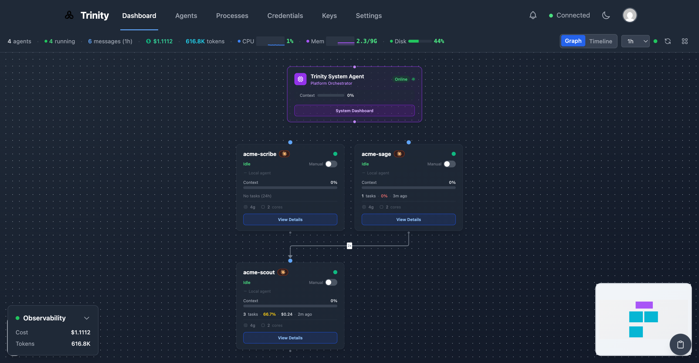
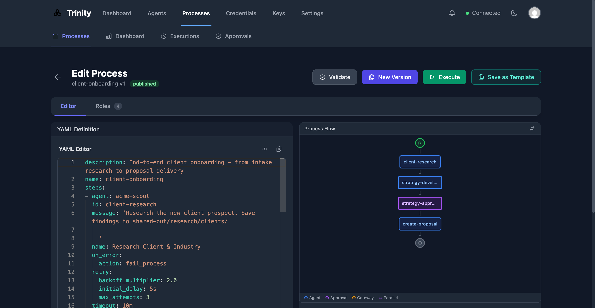
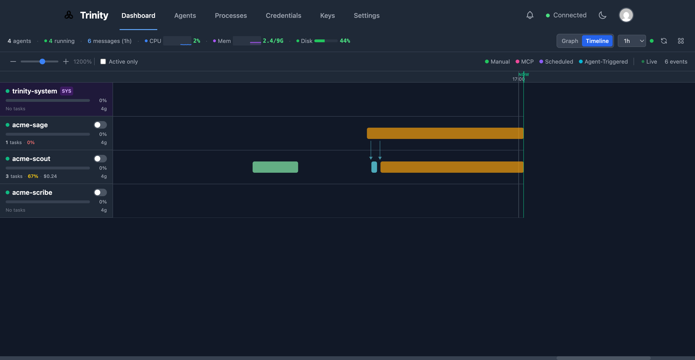

<div align="center">
  
  <h1>Trinity</h1>
  <p><strong>Sovereign infrastructure for autonomous AI agents</strong></p>
  <p>Deploy, orchestrate, and govern AI agent teams with visual interface, enterprise-grade controls, and complete audit trails.</p>

  <p>
    <a href="https://github.com/abilityai/trinity/stargazers"></a>
    <a href="https://github.com/abilityai/trinity/blob/main/LICENSE"></a>
    
    
    
  </p>

  <p>
    <a href="#ways-to-use-trinity">How to Use</a> •
    <a href="#-quick-start">Quick Start</a> •
    <a href="#features">Features</a> •
    <a href="https://youtu.be/SWpNphnuPpQ">Demo Video</a> •
    <a href="#documentation">Docs</a> •
    <a href="#community--support">Community</a>
  </p>

  <br/>
  <a href="https://youtu.be/SWpNphnuPpQ">
    
  </a>
  <br/><br/>
  
</div>

---

## Why Trinity?

**The problem:** Everyone wants autonomous AI agents. But your options are terrible—SaaS platforms where data leaves your security perimeter, custom builds that take 6-12 months, or frameworks that don't handle governance and audit trails.

**The solution:** Trinity is sovereign infrastructure with enterprise-grade controls. Human approvals where decisions matter. Your infrastructure, your security perimeter.

| Option | Problem | Trinity |
|--------|---------|---------|
| **SaaS Platforms** | Data leaves your perimeter, vendor lock-in | Your infrastructure, data never leaves |
| **Build Custom** | 6-12 months, $500K+ engineering | Deploy in minutes |
| **Frameworks** | No governance, no audit trails | Enterprise controls built-in |

---

## Ways to Use Trinity

Trinity supports three primary workflows depending on your starting point:

### 1. Onboard an Existing Claude Code Agent

**You have:** A Claude Code agent (local project with CLAUDE.md)
**You want:** Deploy it to the cloud for autonomous operation, scheduling, and team access

```bash
# In Claude Code, install the Trinity plugin
/plugin marketplace add abilityai/trinity
/plugin install trinity-onboard@abilityai-trinity

# Run the onboarding wizard
/trinity-onboard:onboard
```

The plugin analyzes your agent, creates required configuration files, pushes to GitHub, and deploys to Trinity. After onboarding, you get management skills:

| Skill | Description |
|-------|-------------|
| `/trinity-sync` | Sync local ↔ remote via git |
| `/trinity-remote` | Execute tasks on remote agent |
| `/trinity-schedules` | Manage cron-based automation |

### 2. Create an Agent in Trinity

**You have:** A Trinity instance running
**You want:** Create a new agent from scratch or from a template

1. Open Trinity web UI → **Create Agent**
2. Choose a template:
   - **Blank** — Start fresh, define behavior via chat
   - **Built-in templates** — Pre-configured for common use cases
   - **GitHub template** — `github:org/repo` for custom templates
3. Configure credentials and start chatting

### 3. Deploy a Multi-Agent System

**You have:** A complex workflow requiring multiple specialized agents
**You want:** Orchestrated agent fleet with shared state and coordination

```yaml
# system-manifest.yaml
name: content-pipeline
agents:
  orchestrator:
    template: github:abilityai/agent-corbin
    schedules:
      - cron: "0 9 * * *"
        message: "Run daily content review"
  writer:
    template: github:abilityai/agent-ruby
permissions:
  preset: full-mesh
```

Deploy via MCP: `mcp__trinity__deploy_system(manifest="...")`

See the [Multi-Agent System Guide](docs/MULTI_AGENT_SYSTEM_GUIDE.md) for patterns.

---

### For AI Agents

If you're an AI agent given this repository:

1. **This repo is a Claude Code plugin** — Run `/plugin marketplace add abilityai/trinity` to install Trinity management skills
2. **To deploy yourself to Trinity** — Run `/trinity-onboard:onboard` after installing the plugin
3. **To interact with a Trinity instance** — Use the MCP tools (list_agents, chat_with_agent, etc.) after configuring the MCP server connection
4. **To contribute to Trinity itself** — Read `CLAUDE.md` for development guidelines

---

## Deep Agents vs Chatbots

Unlike reactive chatbots ("System 1" AI), Deep Agents operate with deliberative reasoning ("System 2" AI): they decompose goals into task graphs, persist memory across sessions, delegate to specialized sub-agents, and recover from failures autonomously.

## The Four Pillars of Deep Agency

Trinity implements four foundational capabilities that transform simple AI assistants into autonomous agents:

1. **Hierarchical Delegation** — Orchestrator-Worker pattern with context quarantine
2. **Persistent Memory** — Virtual filesystems, vector databases, episodic memory
3. **Extreme Context Engineering** — High-Order Prompts defining reasoning processes
4. **Autonomous Operations** — Scheduling, monitoring, and self-healing capabilities

## Features

### Core Platform
- **Isolated Agent Containers** — Each agent runs in its own Docker container with dedicated resources
- **Template-Based Deployment** — Create agents from pre-configured templates or custom configurations
- **Real-Time Monitoring** — WebSocket-based activity streaming, telemetry, and context tracking
- **Dashboard Timeline View** — Visual timeline showing executions with trigger-based color coding (manual/scheduled/MCP/agent-triggered)
- **Host Telemetry** — Real-time CPU, memory, and disk monitoring in the dashboard header
- **First-Time Setup Wizard** — Guided setup for admin password and API key configuration
- **Package Persistence** — Installed packages survive container recreation via `~/.trinity/setup.sh`
- **Base Image Versioning** — Track agent versions and detect when updates are available

### Process Engine
- **YAML-Based Workflows** — Define multi-step business processes with declarative YAML syntax
- **Six Step Types** — agent_task, human_approval, gateway (conditional), timer, notification, sub_process
- **Human-in-the-Loop** — Approval gates with inbox, timeout handling, and decision tracking
- **Process Templates** — Pre-built templates for common workflows (content pipelines, onboarding, etc.)
- **AI Process Assistant** — Chat-based assistant that helps create and edit process definitions
- **Real-Time Monitoring** — Live execution progress with step-by-step visibility
- **Analytics & Cost Tracking** — Metrics, trends, and cost threshold alerts per process

<p align="center">
  
</p>

### Agent Capabilities
- **Multi-Runtime Support** — Choose between Claude Code (Anthropic) or Gemini CLI (Google) per agent
- **MCP Integration** — 21 tools for external agent orchestration via Model Context Protocol
- **Agent-to-Agent Communication** — Hierarchical delegation with fine-grained permission controls
- **Persistent Memory** — File-based and database-backed memory across sessions
- **Shared Folders** — File-based state sharing between agents via Docker volumes
- **Parallel Task Execution** — Stateless parallel tasks for orchestrator-worker patterns
- **Agent Dashboard** — Custom dashboards defined via `dashboard.yaml` with 11 widget types
- **Full Capabilities Mode** — Optional elevated permissions for agents that need `apt-get`, `sudo`, etc.
- **Runaway Prevention** — `max_turns` parameter limits agent execution depth

### Operations
- **System Manifest Deployment** — Deploy multi-agent systems from YAML configuration
- **Internal System Agent** — Platform orchestrator for fleet health monitoring and operations
- **Credential Management** — Direct file injection with encrypted git storage (`.credentials.enc`)
- **Scheduling** — Cron-based automation with dedicated scheduler service and Redis distributed locks
- **Live Execution Streaming** — Real-time streaming of execution logs to the web UI
- **Execution Termination** — Stop running executions gracefully via SIGINT/SIGKILL
- **Trinity Connect** — WebSocket event streaming for local Claude Code integration with MCP key authentication
- **OpenTelemetry Metrics** — Cost, token usage, and productivity tracking
- **Public Agent Links** — Shareable links for unauthenticated agent access
- **File Manager** — Browse, preview, and download agent workspace files via web UI
- **Ephemeral SSH Access** — Generate time-limited SSH credentials (key or password) for direct agent access

<p align="center">
  
</p>

## Comparison

| Feature | Trinity | Custom Build | LangChain/CrewAI | SaaS Platforms |
|---------|:-------:|:------------:|:----------------:|:--------------:|
| Time to production | Minutes | 6-12 months | Weeks | Instant |
| Sovereignty | ✅ | ✅ | ✅ | ❌ |
| Workflow orchestration | ✅ | DIY | ❌ | Limited |
| Human approval gates | ✅ | DIY | ❌ | ❌ |
| Docker isolation per agent | ✅ | DIY | ❌ | ❌ |
| Complete audit trail | ✅ | DIY | ❌ | Basic |
| Cost tracking per workflow | ✅ | DIY | ❌ | Basic |
| State persistence | GitHub sync | DIY | Partial | Session-only |
| Open source | ✅ | N/A | ✅ | ❌ |

---

## Quick Start

### Prerequisites

- Docker and Docker Compose v2+
- Anthropic API key (for Claude-powered agents) OR Google API key (for Gemini-powered agents)

### One-Line Install

```bash
curl -fsSL https://raw.githubusercontent.com/abilityai/trinity/main/install.sh | bash
```

This will clone the repository, configure environment, build the base image, and start all services.

### Manual Installation

```bash
# 1. Clone the repository
git clone https://github.com/abilityai/trinity.git
cd trinity

# 2. Configure environment
cp .env.example .env
# Edit .env - at minimum set:
#   SECRET_KEY (generate with: openssl rand -hex 32)

# 3. Build the base agent image
./scripts/deploy/build-base-image.sh

# 4. Start all services
./scripts/deploy/start.sh
```

### First-Time Setup

On first launch, Trinity will guide you through initial setup:

1. Open http://localhost — you'll be redirected to the setup wizard
2. Set your **admin password** (minimum 8 characters)
3. Log in with username `admin` and your new password
4. Go to **Settings** → **API Keys** to configure your Anthropic API key

### Access

- **Web UI**: http://localhost
- **API Docs**: http://localhost:8000/docs
- **MCP Server**: http://localhost:8080/mcp

### Create Your First Agent

1. Open http://localhost
2. Click **Create Agent**
3. Enter a name and select a template (or leave blank for a basic agent)
4. Click **Create**

Your agent will start automatically. Use the Chat tab to interact with it.

## Architecture

```
┌─────────────────────────────────────────────────────────────────┐
│                       Trinity Platform                           │
├─────────────────────────────────────────────────────────────────┤
│  Frontend (Vue.js)  │  Backend (FastAPI)  │  MCP Server         │
│      Port 80        │     Port 8000       │    Port 8080        │
├─────────────────────────────────────────────────────────────────┤
│  Scheduler Service  │  Redis (secrets +   │  SQLite (data)      │
│    Port 8001        │   distributed locks)│   /data volume      │
├─────────────────────────────────────────────────────────────────┤
│  Vector (logs)      │                                           │
│    Port 8686        │                                           │
├─────────────────────────────────────────────────────────────────┤
│                    Agent Containers                              │
│  ┌─────────┐  ┌─────────┐  ┌─────────┐  ┌────────────────┐    │
│  │ Agent 1 │  │ Agent 2 │  │ Agent N │  │ trinity-system │    │
│  └─────────┘  └─────────┘  └─────────┘  └────────────────┘    │
├─────────────────────────────────────────────────────────────────┤
│  (Optional) OTel Collector - Port 4317/8889 for metrics export  │
└─────────────────────────────────────────────────────────────────┘
```

## Project Structure

```
trinity/
├── src/
│   ├── backend/          # FastAPI backend API
│   │   └── services/
│   │       └── process_engine/  # Process Engine (DDD architecture)
│   ├── frontend/         # Vue.js 3 + Tailwind CSS web UI
│   ├── mcp-server/       # Trinity MCP server (21 tools)
│   └── scheduler/        # Dedicated scheduler service (Redis locks)
├── docker/
│   ├── base-image/       # Universal agent base image
│   ├── backend/          # Backend Dockerfile
│   ├── frontend/         # Frontend Dockerfile
│   └── scheduler/        # Scheduler Dockerfile
├── config/
│   ├── agent-templates/  # Pre-configured agent templates
│   ├── process-templates/ # Process definition templates
│   ├── process-docs/     # In-app documentation content
│   ├── vector.yaml       # Vector log aggregation config
│   ├── otel-collector.yaml # OpenTelemetry collector config
│   └── trinity-meta-prompt/ # Platform injection templates
├── scripts/
│   └── deploy/           # Deployment and management scripts
└── docs/                 # Documentation
```

## Agent Templates

Trinity deploys agents from templates. Templates define agent behavior, resources, and credential requirements.

### Template Structure

```
my-template/
├── template.yaml              # Metadata, resources, credentials
├── CLAUDE.md                  # Agent instructions
├── .claude/                   # Claude Code configuration
│   ├── agents/               # Sub-agents (optional)
│   ├── commands/             # Slash commands (optional)
│   └── skills/               # Custom skills (optional)
├── .mcp.json.template        # MCP config with ${VAR} placeholders
└── .env.example              # Documents required env vars
```

### Design Guides

| Guide | Use Case |
|-------|----------|
| [Trinity Compatible Agent Guide](docs/TRINITY_COMPATIBLE_AGENT_GUIDE.md) | **Single agents** — Template structure, CLAUDE.md, credentials, platform injection |
| [Multi-Agent System Guide](docs/MULTI_AGENT_SYSTEM_GUIDE.md) | **Multi-agent systems** — Architecture patterns, shared folders, coordination, deployment |

The Multi-Agent System Guide covers Trinity's platform capabilities that enable autonomous operation:
- **Scheduling System** — Cron-based autonomous execution
- **Shared Folders** — File-based state sharing between agents
- **Agent-to-Agent MCP** — Real-time delegation and collaboration
- **Centralized Logging** — Vector-based log aggregation from all containers

### Public Agent Templates

Trinity includes three reference agent implementations that demonstrate real-world agent patterns. These repositories are **public and available for use as templates** for your own agents:

| Agent | Repository | Purpose |
|-------|------------|---------|
| **Cornelius** | [github.com/abilityai/agent-cornelius](https://github.com/abilityai/agent-cornelius) | Knowledge Base Manager — Obsidian vault management, insight synthesis, research coordination |
| **Corbin** | [github.com/abilityai/agent-corbin](https://github.com/abilityai/agent-corbin) | Business Assistant — Google Workspace integration, task coordination, team management |
| **Ruby** | [github.com/abilityai/agent-ruby](https://github.com/abilityai/agent-ruby) | Content Creator — Multi-platform publishing, social media distribution, content strategy |

These agents demonstrate:
- Production-ready template structure with `template.yaml`, `CLAUDE.md`, and `.claude/` configuration
- Agent-to-agent collaboration patterns via Trinity MCP
- Custom metrics definitions for specialized tracking
- Credential management for external API integrations
- Real-world slash commands and workflow automation

**Usage**: Create agents from these templates via the Trinity UI:
```bash
# Via UI: Create Agent → Select "github:abilityai/agent-cornelius"
# Via MCP: trinity_create_agent(name="my-agent", template="github:abilityai/agent-cornelius")
```

**Note**: You'll need to configure a `GITHUB_PAT` environment variable in `.env` to use GitHub templates.

## Trinity Onboard Plugin

> See [Ways to Use Trinity](#ways-to-use-trinity) for the quick start guide.

The Trinity Onboard Plugin enables zero-friction deployment of any Claude Code agent to Trinity. After onboarding, you get management skills for ongoing operations:

```bash
# Example post-onboarding workflow
/trinity-sync push                    # Push local changes to remote
/trinity-remote exec "Run my task"    # Execute on remote agent
/trinity-schedules list               # View scheduled tasks
```

For detailed plugin documentation, see [plugins/trinity-onboard/README.md](plugins/trinity-onboard/README.md).

## MCP Integration

Trinity includes an MCP server for external orchestration of agents:

```json
{
  "mcpServers": {
    "trinity": {
      "type": "http",
      "url": "http://localhost:8080/mcp",
      "headers": {
        "Authorization": "Bearer YOUR_API_KEY"
      }
    }
  }
}
```

### Available Tools

#### Agent Management
| Tool | Description |
|------|-------------|
| `list_agents` | List all agents with status |
| `get_agent` | Get detailed agent information |
| `get_agent_info` | Get agent template metadata (capabilities, commands, etc.) |
| `create_agent` | Create a new agent from template |
| `start_agent` | Start a stopped agent |
| `stop_agent` | Stop a running agent |
| `delete_agent` | Delete an agent |

#### Communication
| Tool | Description |
|------|-------------|
| `chat_with_agent` | Send a message and get response (supports parallel mode) |
| `get_chat_history` | Retrieve conversation history |
| `get_agent_logs` | View container logs |

#### System Management
| Tool | Description |
|------|-------------|
| `deploy_system` | Deploy multi-agent system from YAML manifest |
| `list_systems` | List deployed systems with agent counts |
| `restart_system` | Restart all agents in a system |
| `get_system_manifest` | Export system configuration as YAML |

#### Configuration
| Tool | Description |
|------|-------------|
| `list_templates` | List available templates |
| `reload_credentials` | Hot-reload agent credentials |
| `get_credential_status` | Check credential files |
| `get_agent_ssh_access` | Generate ephemeral SSH credentials for direct terminal access |

## Multi-Agent Systems

Deploy coordinated multi-agent systems from a single YAML manifest:

```yaml
name: content-production
description: Autonomous content pipeline

agents:
  orchestrator:
    template: github:abilityai/agent-corbin
    resources: {cpu: "2", memory: "4g"}
    folders: {expose: true, consume: true}
    schedules:
      - name: daily-review
        cron: "0 9 * * *"
        message: "Review today's content pipeline"

  writer:
    template: github:abilityai/agent-ruby
    folders: {expose: true, consume: true}

permissions:
  preset: full-mesh  # All agents can communicate
```

Deploy via MCP or API:
```bash
# Via MCP tool
mcp__trinity__deploy_system(manifest="...")

# Via REST API
curl -X POST http://localhost:8000/api/systems/deploy \
  -H "Content-Type: application/json" \
  -d '{"manifest": "...", "dry_run": false}'
```

See the [Multi-Agent System Guide](docs/MULTI_AGENT_SYSTEM_GUIDE.md) for architecture patterns and best practices.

## Trinity Connect

Trinity Connect enables real-time coordination between local Claude Code instances and Trinity-hosted agents via WebSocket event streaming.

```bash
# Install listener dependencies
brew install websocat jq

# Set your MCP API key (from Settings → API Keys)
export TRINITY_API_KEY="trinity_mcp_xxx"

# Listen for events from a specific agent
./scripts/trinity-listen.sh my-agent completed
```

The listener blocks until a matching event arrives, then prints the event and exits—perfect for event-driven automation loops:

```bash
while true; do
    ./scripts/trinity-listen.sh my-agent completed
    # React to the completed event...
done
```

Events include: `agent_started`, `agent_stopped`, `agent_activity` (chat/task completions), and `schedule_execution_completed`.

## Process Engine

Trinity includes a BPMN-inspired Process Engine for orchestrating multi-step workflows with AI agents, human approvals, and automated scheduling.

### Example Process Definition

```yaml
name: content-review-pipeline
description: Review and publish content with human approval

triggers:
  - type: schedule
    cron: "0 9 * * 1-5"  # Weekdays at 9 AM

steps:
  - id: draft-content
    name: Draft Content
    type: agent_task
    agent: content-writer
    task: "Draft the weekly newsletter based on recent updates"

  - id: review-gate
    name: Editorial Review
    type: human_approval
    title: "Approve Newsletter Draft"
    description: "Review the drafted newsletter before publishing"
    timeout: 24h
    depends_on: [draft-content]

  - id: publish
    name: Publish Content
    type: agent_task
    agent: publisher
    task: "Publish the approved newsletter"
    depends_on: [review-gate]
```

### Step Types

| Type | Description |
|------|-------------|
| `agent_task` | Execute a task via an AI agent |
| `human_approval` | Pause for human decision with timeout |
| `gateway` | Conditional branching based on expressions |
| `timer` | Delay execution for a specified duration |
| `notification` | Send notifications to users or systems |
| `sub_process` | Call another process as a nested workflow |

### AI Process Assistant

The Process Editor includes an AI-powered chat assistant that helps you:
- Create new processes from natural language descriptions
- Edit existing YAML with conversational commands
- Get explanations of step types and syntax
- Debug validation errors

Access it via the **Chat** tab in the Process Editor.

See `docs/PROCESS_DRIVEN_PLATFORM/` for detailed design documents.

## Configuration

### Environment Variables

| Variable | Required | Description |
|----------|----------|-------------|
| `SECRET_KEY` | Yes | JWT signing key (generate with `openssl rand -hex 32`) |
| `ADMIN_PASSWORD` | Yes | Admin password for admin login |
| `ANTHROPIC_API_KEY` | No | For Claude-powered agents (can also be set via Settings UI) |
| `GITHUB_PAT` | No | GitHub PAT for cloning private template repos |
| `OTEL_ENABLED` | No | Enable OpenTelemetry metrics export (default: false) |
| `EMAIL_PROVIDER` | No | Email provider: console (dev), smtp, sendgrid, resend |
| `EXTRA_CORS_ORIGINS` | No | Additional CORS origins |

See [.env.example](.env.example) for the complete list.

### Authentication

Trinity supports two login methods:

1. **Email Login** (primary): Users enter email → receive 6-digit code → login
2. **Admin Login**: Password-based login for admin user

```bash
# Admin password (required)
ADMIN_PASSWORD=your-secure-password

# Email provider for verification codes
EMAIL_PROVIDER=console  # Use 'resend' or 'smtp' for production
```

## Documentation

- [Development Workflow](docs/DEVELOPMENT_WORKFLOW.md) — How to develop Trinity (context loading, testing, documentation)
- [Deployment Guide](docs/DEPLOYMENT.md) — Production deployment instructions
- [Versioning & Upgrades](docs/VERSIONING_AND_UPGRADES.md) — Version strategy and upgrade procedures
- [Gemini Support Guide](docs/GEMINI_SUPPORT.md) — Using Gemini CLI runtime for cost optimization
- [Trinity Compatible Agent Guide](docs/TRINITY_COMPATIBLE_AGENT_GUIDE.md) — Creating Trinity-compatible agents
- [Multi-Agent System Guide](docs/MULTI_AGENT_SYSTEM_GUIDE.md) — Building multi-agent systems with coordinated workflows
- [Process Engine Design](docs/PROCESS_DRIVEN_PLATFORM/) — Process Engine architecture and design documents
- [Testing Guide](docs/TESTING_GUIDE.md) — Testing approach and standards
- [Contributing Guide](CONTRIBUTING.md) — How to contribute (PRs, code standards)
- [Known Issues](docs/KNOWN_ISSUES.md) — Current limitations and workarounds

## Development

```bash
# Start in development mode (hot reload)
./scripts/deploy/start.sh

# View logs
docker compose logs -f backend
docker compose logs -f frontend

# Rebuild after changes
docker compose build backend
docker compose up -d backend
```

## License

This project is licensed under the [Polyform Noncommercial License 1.0.0](LICENSE).

**Free for**:
- Personal use
- Research and education
- Non-profit organizations
- Hobby projects

**Commercial use** requires a separate license. Contact [hello@ability.ai](mailto:hello@ability.ai) for commercial licensing.

## Contributing

See [CONTRIBUTING.md](CONTRIBUTING.md) for guidelines.

## Community & Support

- **GitHub Issues**: [Report bugs and request features](https://github.com/abilityai/trinity/issues)
- **GitHub Discussions**: [Ask questions and share ideas](https://github.com/abilityai/trinity/discussions)
- **Demo Video**: [Watch Trinity in action](https://youtu.be/SWpNphnuPpQ)
- **Security Issues**: See [SECURITY.md](SECURITY.md) for reporting vulnerabilities
- **Commercial inquiries**: [hello@ability.ai](mailto:hello@ability.ai)

---

<div align="center">
  <sub>Built by <a href="https://ability.ai">Ability.ai</a> — Sovereign AI infrastructure for the autonomous enterprise</sub>
</div>
