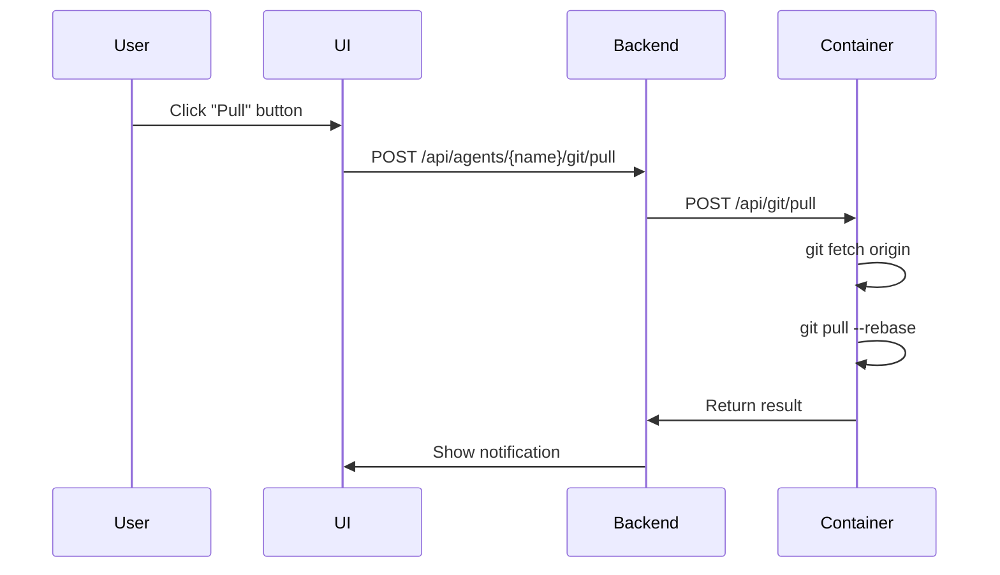
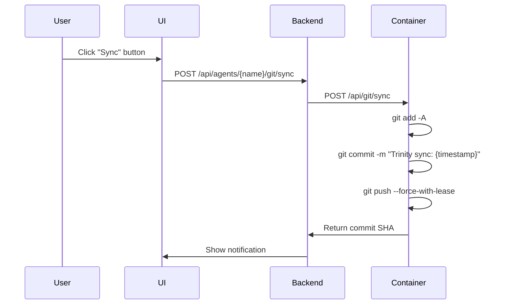

# Feature: GitHub Sync (Phase 7)

## Overview

GitHub-native agents can synchronize with GitHub repositories in two modes:

### Source Mode (Default - Recommended)
**Unidirectional pull-only sync**: Agent tracks a source branch (default: `main`) and can pull updates on demand. Changes made in the agent are local only and not pushed back. This is ideal for agents developed locally and deployed to Trinity.

### Working Branch Mode (Legacy)
**Bidirectional sync**: Agent gets a unique working branch (`trinity/{agent-name}/{instance-id}`) and can push changes back to GitHub. This is the original Phase 7 implementation, now available as an opt-in feature.

## User Stories

**Source Mode**: As a developer, I want to develop agents locally, push to GitHub, and have Trinity pull updates so I can iterate quickly without merge conflicts.

**Working Branch Mode**: As a team using Trinity-native development, I want agent changes synced to a working branch so I can review them via pull requests.

---

## Entry Points

| Type | Location | Description |
|------|----------|-------------|
| **UI** | Agent Detail header | Pull/Push buttons (blue Pull with commits behind count, orange Push with local changes count) |
| **UI** | Git tab in agent detail | Git log/history view |
| **API** | `POST /api/agents/{name}/git/pull` | Pull latest from source branch |
| **API** | `POST /api/agents/{name}/git/sync` | Push changes to GitHub (working branch mode) |
| **API** | `GET /api/agents/{name}/git/status` | Get git repository status |
| **API** | `GET /api/agents/{name}/git/config` | Get stored git config |

---

## Source Mode (Default)

### Configuration

When creating an agent from a GitHub template:

```python
# AgentConfig defaults (src/backend/models.py)
source_branch: Optional[str] = "main"    # Branch to pull from
source_mode: Optional[bool] = True       # True = source mode (pull only)
```

### Environment Variables

```bash
GITHUB_REPO=Owner/repo
GITHUB_PAT=ghp_xxx
GIT_SYNC_ENABLED=true
GIT_SOURCE_MODE=true           # Enables source mode
GIT_SOURCE_BRANCH=main         # Branch to track (default: main)
```

### Startup Behavior (`docker/base-image/startup.sh`)

```bash
# Source mode: checkout source branch directly
if [ "${GIT_SOURCE_MODE}" = "true" ]; then
    SOURCE_BRANCH="${GIT_SOURCE_BRANCH:-main}"
    git checkout "${SOURCE_BRANCH}"
    git branch --set-upstream-to="origin/${SOURCE_BRANCH}"
fi
```

### Sequence Diagram: Pull from GitHub



### Workflow

```
+-----------+      push       +--------------+      pull       +-------------+
|   Local   |  ----------->   |    GitHub    |   <-----------  |   Trinity   |
|   Dev     |                 |    (main)    |                 |   Agent     |
+-----------+                 +--------------+                 +-------------+
```

1. Develop agent locally
2. Push to GitHub (main branch)
3. Create agent in Trinity from `github:Owner/repo`
4. Agent clones and stays on `main` branch
5. Click "Pull" button to fetch latest changes

### Content Folder Convention

Large generated files (videos, audio, images, exports) should go in `content/` which is automatically gitignored:

```bash
# Created by startup.sh
mkdir -p content/{videos,audio,images,exports}
echo "content/" >> .gitignore
```

---

## Working Branch Mode (Legacy)

### Configuration

To use working branch mode, explicitly disable source mode:

```python
AgentConfig(
    github_repo="Owner/repo",
    source_mode=False,  # Disable source mode
    # working_branch auto-generated: trinity/{agent-name}/{instance-id}
)
```

### Environment Variables

```bash
GITHUB_REPO=Owner/repo
GITHUB_PAT=ghp_xxx
GIT_SYNC_ENABLED=true
GIT_WORKING_BRANCH=trinity/my-agent/a1b2c3d4  # Auto-generated
```

### Startup Behavior

```bash
# Working branch mode: create unique branch
if [ -n "${GIT_WORKING_BRANCH}" ]; then
    git checkout -b "${GIT_WORKING_BRANCH}"
    git push -u origin "${GIT_WORKING_BRANCH}"
fi
```

### Sequence Diagram: Sync to GitHub



---

## Data Layer

### Database Model: AgentGitConfig

```python
# src/backend/db_models.py
class AgentGitConfig(BaseModel):
    id: str
    agent_name: str
    github_repo: str           # e.g., "Owner/repo"
    working_branch: str        # "main" (source mode) or "trinity/{agent}/{id}" (legacy)
    instance_id: str           # 8-char unique identifier
    source_branch: str = "main"  # Branch to pull from
    source_mode: bool = False    # True = source mode, False = working branch mode
    created_at: datetime
    last_sync_at: Optional[datetime] = None
    last_commit_sha: Optional[str] = None
    sync_enabled: bool = True
    sync_paths: Optional[str] = None  # JSON array
```

### Database Table

```sql
CREATE TABLE IF NOT EXISTS agent_git_config (
    id TEXT PRIMARY KEY,
    agent_name TEXT UNIQUE NOT NULL,
    github_repo TEXT NOT NULL,
    working_branch TEXT NOT NULL,
    instance_id TEXT NOT NULL,
    source_branch TEXT DEFAULT 'main',
    source_mode INTEGER DEFAULT 0,
    created_at TEXT NOT NULL,
    last_sync_at TEXT,
    last_commit_sha TEXT,
    sync_enabled INTEGER DEFAULT 1,
    sync_paths TEXT,
    FOREIGN KEY (agent_name) REFERENCES agent_ownership(agent_name)
);
```

---

## Backend Layer

### Access Control Dependencies

Git endpoints use FastAPI dependencies for access control (defined in `src/backend/dependencies.py:212-263`):

| Dependency | Path Parameter | Access Level | Used By |
|------------|----------------|--------------|---------|
| `AuthorizedAgentByName` | `{agent_name}` | Read access | `get_git_status`, `get_git_log`, `get_git_config` |
| `OwnedAgentByName` | `{agent_name}` | Owner access | `sync_to_github`, `pull_from_github`, `initialize_github_sync` |

**Pattern:**
```python
# src/backend/routers/git.py:43-47
@router.get("/{agent_name}/git/status")
async def get_git_status(
    agent_name: AuthorizedAgentByName,  # Validates user can access agent
    request: Request
):
```

The dependency automatically:
1. Extracts `agent_name` from the path
2. Gets current user from JWT/MCP key
3. Checks access via `db.can_user_access_agent()` or `db.can_user_share_agent()`
4. Returns agent name or raises 403

### Endpoint Signatures

| Endpoint | Line | Dependency | Access Level |
|----------|------|------------|--------------|
| `GET /{agent_name}/git/status` | 43 | `AuthorizedAgentByName` | Read |
| `POST /{agent_name}/git/sync` | 95 | `OwnedAgentByName` | Owner |
| `GET /{agent_name}/git/log` | 150 | `AuthorizedAgentByName` | Read |
| `POST /{agent_name}/git/pull` | 177 | `OwnedAgentByName` | Owner |
| `GET /{agent_name}/git/config` | 214 | `AuthorizedAgentByName` | Read |
| `POST /{agent_name}/git/initialize` | 251 | `OwnedAgentByName` | Owner |

### Settings Service Integration

GitHub PAT is retrieved via the centralized settings service:

```python
# src/backend/routers/git.py:274
from services.settings_service import get_github_pat

# Used in initialize_github_sync endpoint (line 301)
github_pat = get_github_pat()
```

**Settings Service** (`src/backend/services/settings_service.py:69-74`):
```python
def get_github_pat(self) -> str:
    """Get GitHub PAT from settings, fallback to env var."""
    key = self.get_setting('github_pat')
    if key:
        return key
    return os.getenv('GITHUB_PAT', '')
```

### GitHub Service Integration

Repository operations use the centralized GitHub service:

```python
# src/backend/routers/git.py:275
from services.github_service import GitHubService, GitHubError

# Used in initialize_github_sync endpoint (lines 312-327)
gh = GitHubService(github_pat)
repo_info = await gh.check_repo_exists(body.repo_owner, body.repo_name)

if not repo_info.exists:
    create_result = await gh.create_repository(
        owner=body.repo_owner,
        name=body.repo_name,
        private=body.private,
        description=body.description
    )
```

**GitHub Service** (`src/backend/services/github_service.py:60-265`):
- `check_repo_exists(owner, name)` - Returns `GitHubRepoInfo`
- `create_repository(owner, name, private, description)` - Returns `GitHubCreateResult`
- `validate_token()` - Returns `(is_valid, username)`
- `get_owner_type(owner)` - Returns `OwnerType.USER` or `OwnerType.ORGANIZATION`

### Git Service Layer

**Location**: `src/backend/services/git_service.py`

| Function | Line | Description |
|----------|------|-------------|
| `generate_instance_id()` | 22 | Create 8-char UUID for agent |
| `generate_working_branch()` | 27 | Create `trinity/{agent}/{id}` branch name |
| `create_git_config_for_agent()` | 32 | Store config in database |
| `get_git_status()` | 64 | Proxy to agent `/api/git/status` |
| `sync_to_github()` | 88 | Proxy to agent `/api/git/sync` with conflict handling |
| `get_git_log()` | 172 | Proxy to agent `/api/git/log` |
| `pull_from_github()` | 196 | Proxy to agent `/api/git/pull` with conflict handling |
| `get_agent_git_config()` | 239 | Get config from database |
| `initialize_git_in_container()` | 262 | Initialize git in agent container |
| `check_git_initialized()` | 400 | Check if git exists in container |

---

## Frontend Layer

### useGitSync Composable

**Location**: `src/frontend/src/composables/useGitSync.js`

```javascript
// Pull from GitHub (source mode)
const pullFromGithub = async () => {
  const result = await agentsStore.pullFromGithub(agentRef.value.name)
  showNotification(result.message, result.success ? 'success' : 'error')
  await loadGitStatus()
}

// Sync to GitHub (working branch mode)
const syncToGithub = async () => {
  const result = await agentsStore.syncToGithub(agentRef.value.name)
  showNotification(`Synced ${result.files_changed} file(s)`, 'success')
  await loadGitStatus()
}
```

### UI Controls (AgentDetail.vue)

| Button | Color | Display | Action | Mode |
|--------|-------|---------|--------|------|
| Pull | Blue (when behind) / Gray (up to date) | `Pull (N)` showing commits behind | `pullFromGithub()` | Both modes |
| Push | Orange (when changes) / Gray (clean) | `Push (N)` showing local changes count | `syncToGithub()` | Working branch mode |
| Refresh | Gray | Icon only | `refreshGitStatus()` | Both modes |

---

## API Reference

### GET /api/agents/{name}/git/config

Returns git configuration including source mode settings:

```json
{
  "git_enabled": true,
  "github_repo": "Owner/repo",
  "working_branch": "main",
  "source_branch": "main",
  "source_mode": true,
  "instance_id": "a1b2c3d4",
  "created_at": "2025-12-30T12:00:00",
  "last_sync_at": null,
  "sync_enabled": true
}
```

### POST /api/agents/{name}/git/pull

Pull latest changes from source branch:

```json
{
  "success": true,
  "message": "Pulled latest changes from main"
}
```

### POST /api/agents/{name}/git/sync

Push changes to working branch (only in working branch mode):

```json
{
  "success": true,
  "commit_sha": "abc123...",
  "files_changed": 3,
  "branch": "trinity/my-agent/a1b2c3d4",
  "sync_time": "2025-12-30T12:00:00"
}
```

---

## Migration from Working Branch to Source Mode

Existing agents using working branch mode will continue to work. To switch an agent to source mode:

1. Delete the agent
2. Recreate with default settings (source_mode=true)

Or, if you want to preserve agent state:
1. Sync any pending changes to GitHub
2. Merge working branch to main
3. Delete and recreate the agent

---

## Conflict Resolution

Both pull and sync operations support automatic conflict detection and resolution strategies.

### Pull Conflict Strategies

When a pull operation fails due to local changes conflicting with remote:

| Strategy | Description | When to Use |
|----------|-------------|-------------|
| `clean` (default) | Simple pull with rebase. Fails if conflicts. | When you have no local changes |
| `stash_reapply` | Stash local changes, pull, reapply stash | When you want to keep local changes |
| `force_reset` | Hard reset to remote, discard all local changes | When remote is source of truth |

### Sync (Push) Conflict Strategies

When a push operation fails because remote has newer changes:

| Strategy | Description | When to Use |
|----------|-------------|-------------|
| `normal` (default) | Stage, commit, push. Fails if remote has changes. | When you expect clean push |
| `pull_first` | Pull latest first, then stage, commit, push | Standard workflow with concurrent changes |
| `force_push` | Force push, overwriting remote | When local is source of truth |

### Conflict Resolution UI

When a conflict is detected (HTTP 409 response), the UI shows a modal with options:

```
+---------------------------------------------+
| Pull Conflict                               |
|                                             |
| Pull failed: merge conflict detected        |
|                                             |
| +-------------------------------------------+
| | Stash & Reapply (Recommended)             |
| | Save local changes, pull, reapply         |
| +-------------------------------------------+
|                                             |
| +-------------------------------------------+
| | Force Replace Local                       |
| | Discard all local changes (destructive)   |
| +-------------------------------------------+
|                                             |
|                              [Cancel]       |
+---------------------------------------------+
```

### API Request Format

```json
// Pull with strategy
POST /api/agents/{name}/git/pull
{
  "strategy": "stash_reapply"  // "clean", "stash_reapply", "force_reset"
}

// Sync with strategy
POST /api/agents/{name}/git/sync
{
  "strategy": "pull_first",  // "normal", "pull_first", "force_push"
  "message": "Optional commit message"
}
```

### Error Response (Conflict)

```json
// HTTP 409 Conflict
{
  "detail": "Pull failed: merge conflict detected"
}
// Header: X-Conflict-Type: merge_conflict | local_uncommitted | push_rejected
```

### Component Files

| Component | File | Description |
|-----------|------|-------------|
| Modal | `src/frontend/src/components/GitConflictModal.vue` | Conflict resolution UI |
| Composable | `src/frontend/src/composables/useGitSync.js` | State management with conflict handling |
| Agent-Server | `docker/base-image/agent_server/routers/git.py` | Git operations with strategies |
| Backend Router | `src/backend/routers/git.py` | API endpoints with strategy params |
| Git Service | `src/backend/services/git_service.py` | Proxy to agent with conflict detection |
| Settings Service | `src/backend/services/settings_service.py` | GitHub PAT retrieval |
| GitHub Service | `src/backend/services/github_service.py` | GitHub API operations |
| Dependencies | `src/backend/dependencies.py` | Access control (lines 212-263) |

---

## Security Considerations

1. **GitHub PAT**: Passed as environment variable, never exposed in logs or API responses
2. **Remote URL Sanitization**: Credentials stripped before display
3. **Force Push Protection**: Uses `--force-with-lease` for normal pushes
4. **Force Operations Warning**: UI shows red destructive warnings for force operations
5. **Infrastructure Files**: `content/`, `.local/` auto-added to `.gitignore`
6. **Access Control**: Read endpoints use `AuthorizedAgentByName`, write endpoints use `OwnedAgentByName`

---

## Status

Working - Architecture cleanup (2025-12-31)

---

## Related Flows

| Direction | Flow | Relationship |
|-----------|------|--------------|
| **Upstream** | [Template Processing](template-processing.md) | GitHub templates trigger git sync setup |
| **Upstream** | [Agent Lifecycle](agent-lifecycle.md) | Agent creation enables git sync |
| **Downstream** | Content generation | Large files go to `content/` folder |

---

## Revision History

| Date | Changes |
|------|---------|
| 2026-01-12 | Renamed "Sync" button to "Push" for consistent Pull/Push terminology. Pull button now shows commits behind count when remote has updates. Both buttons use dynamic coloring (active color when action available, gray when up to date). |
| 2025-12-31 | Updated with access control dependencies (`AuthorizedAgentByName`, `OwnedAgentByName`), settings service (`get_github_pat()`), and GitHub service integration. Added line number references. |
| 2025-12-30 | Added conflict resolution with pull/sync strategies and GitConflictModal UI. |
| 2025-12-30 | Added source mode (pull-only) as default. Working branch mode now legacy. |
| 2025-12-06 | Updated agent-server references to modular structure |
| 2025-12-02 | Initial documentation (working branch mode) |
