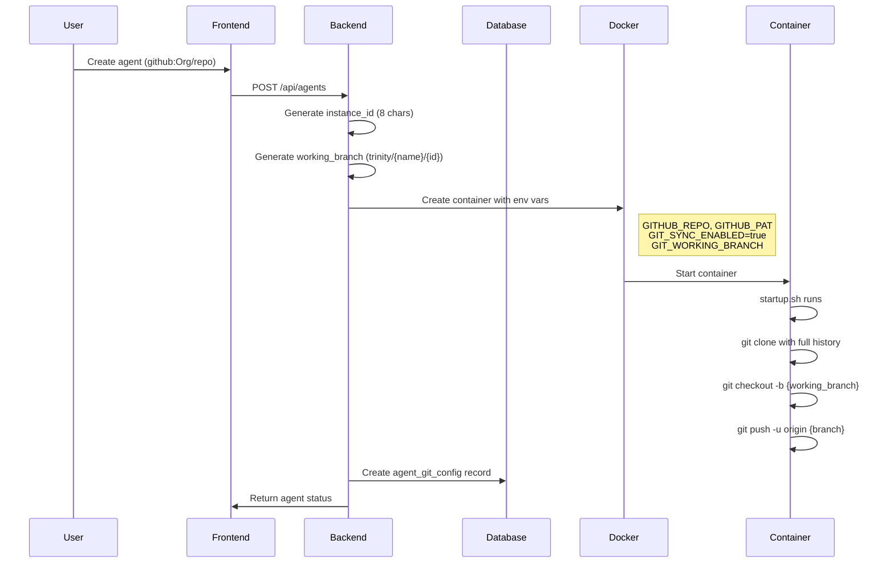
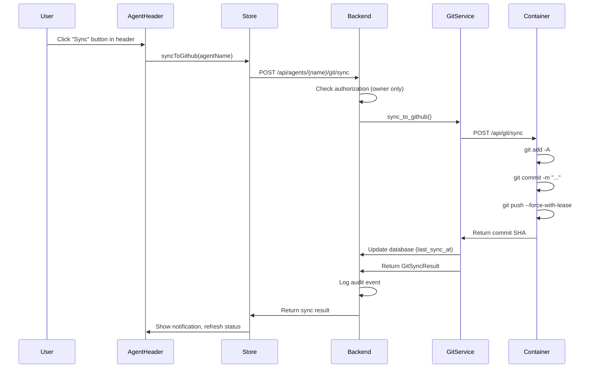

# Feature: GitHub Bidirectional Sync (Phase 7)

## Overview
GitHub-native agents can sync their working directory changes back to GitHub. Each agent instance gets a unique working branch (`trinity/{agent-name}/{instance-id}`), and users can push changes from the agent container to GitHub or pull updates from the remote.

## User Story
As a **developer using GitHub-native agents**, I want to **sync code changes made by the agent back to GitHub** so that **work done by the agent is version-controlled and can be reviewed via pull requests**.

---

## Entry Points

| Type | Location | Description |
|------|----------|-------------|
| **UI** | `src/frontend/src/views/AgentDetail.vue:68-109` | Sync/refresh buttons in agent header (main controls) |
| **UI** | `src/frontend/src/views/AgentDetail.vue:256-266` | Git tab in agent detail view |
| **UI** | `src/frontend/src/components/GitPanel.vue` | Git log/history view (read-only) |
| **API** | `GET /api/agents/{name}/git/status` | Get git repository status |
| **API** | `POST /api/agents/{name}/git/sync` | Push changes to GitHub |
| **API** | `GET /api/agents/{name}/git/log` | Get commit history |
| **API** | `POST /api/agents/{name}/git/pull` | Pull from remote |
| **API** | `GET /api/agents/{name}/git/config` | Get stored git config |

---

## Sequence Diagrams

### Agent Creation with Git Sync



### Sync to GitHub Flow



---

## Frontend Layer

### Components

#### AgentDetail.vue (Main Controls)
**Location**: `src/frontend/src/views/AgentDetail.vue`

The primary sync controls are now in the agent header, next to Start/Stop buttons:

| Line | Element | Purpose |
|------|---------|---------|
| 68-109 | Git sync controls section | Sync button, refresh, status indicator |
| 71-88 | Sync button | Orange when changes pending, gray when synced |
| 89-98 | Refresh button | Refreshes git status |
| 100-108 | Git indicator (stopped) | Shows "Git enabled" when agent is stopped |
| 256-266 | Git tab button | Only visible when `hasGitSync` is true |
| 737-741 | Git tab content | Renders `<GitPanel>` component |
| 819-822 | `hasGitSync` computed | Checks if template starts with `github:` |
| 824-836 | Git state refs | `gitStatus`, `gitLoading`, `gitSyncing`, computed helpers |
| 1311-1367 | Git methods | `loadGitStatus()`, `syncToGithub()`, polling functions |

**Key Methods**:
```javascript
// Git sync from header
const syncToGithub = async () => {
  const result = await agentsStore.syncToGithub(agent.value.name)
  if (result.success) {
    showNotification(`Synced ${result.files_changed} file(s) to GitHub`, 'success')
  }
  await loadGitStatus()
}

// Git status polling (every 30s when running)
const startGitStatusPolling = () => {
  loadGitStatus()
  gitStatusInterval = setInterval(loadGitStatus, 30000)
}
```

#### GitPanel.vue (Log View)
**Location**: `src/frontend/src/components/GitPanel.vue`

Read-only view for git history and status details:

| Line | Element | Purpose |
|------|---------|---------|
| 10-16 | `v-if="!gitStatus?.git_enabled"` | Shows "not enabled" state |
| 19-32 | `v-else-if="gitStatus?.agent_running === false"` | Shows "must be running" state |
| 35-76 | Repository info header | Shows repo URL, branch, sync status |
| 78-95 | Pending changes list | Displays file changes with status indicators |
| 98-120 | Last commit display | Shows most recent commit details |
| 123-140 | Recent commits | Scrollable commit history |
| 143-149 | Database config | Last sync time, commit SHA |

### State Management

**Location**: `src/frontend/src/stores/agents.js:258-302`

```javascript
// Line 259-265: Get git status
async getGitStatus(name) {
  const response = await axios.get(`/api/agents/${name}/git/status`, {
    headers: authStore.authHeader
  })
  return response.data
}

// Line 275-285: Sync to GitHub
async syncToGithub(name, message = null, paths = null) {
  const payload = {}
  if (message) payload.message = message
  if (paths) payload.paths = paths
  const response = await axios.post(`/api/agents/${name}/git/sync`,
    payload,
    { headers: authStore.authHeader }
  )
  return response.data
}

// Line 287-293: Pull from GitHub
async pullFromGithub(name) {
  const response = await axios.post(`/api/agents/${name}/git/pull`, {}, {
    headers: authStore.authHeader
  })
  return response.data
}

// Line 295-302: Get git log
async getGitLog(name, limit = 10) {
  const response = await axios.get(`/api/agents/${name}/git/log`, {
    params: { limit },
    headers: authStore.authHeader
  })
  return response.data
}
```

---

## Backend Layer

### Router: git.py
**Location**: `src/backend/routers/git.py`

| Line | Endpoint | Method | Handler |
|------|----------|--------|---------|
| 29-83 | `/api/agents/{agent_name}/git/status` | GET | `get_git_status()` |
| 86-144 | `/api/agents/{agent_name}/git/sync` | POST | `sync_to_github()` |
| 147-176 | `/api/agents/{agent_name}/git/log` | GET | `get_git_log()` |
| 179-212 | `/api/agents/{agent_name}/git/pull` | POST | `pull_from_github()` |
| 215-252 | `/api/agents/{agent_name}/git/config` | GET | `get_git_config()` |

**Authorization Logic**:
```python
# Line 47-48: Read access - can_user_access_agent (owner, shared, or admin)
if not db.can_user_access_agent(current_user.username, agent_name):
    raise HTTPException(status_code=403, detail="Access denied")

# Line 109-110: Write access - can_user_share_agent (owner or admin only)
if not db.can_user_share_agent(current_user.username, agent_name):
    raise HTTPException(status_code=403, detail="Only agent owners can sync to GitHub")
```

### Service: git_service.py
**Location**: `src/backend/services/git_service.py`

| Line | Function | Purpose |
|------|----------|---------|
| 17-19 | `generate_instance_id()` | Creates 8-char UUID |
| 22-24 | `generate_working_branch()` | Returns `trinity/{agent}/{id}` |
| 27-56 | `create_git_config_for_agent()` | Creates DB record on agent creation |
| 59-80 | `get_git_status()` | Calls agent's internal `/api/git/status` |
| 83-153 | `sync_to_github()` | Orchestrates sync via agent container |
| 156-177 | `get_git_log()` | Fetches commit history from agent |
| 180-205 | `pull_from_github()` | Pulls remote changes into agent |
| 208-215 | `get/delete_agent_git_config()` | Database accessors |

**Container Communication**:
```python
# Line 71-77: Call agent's internal API via Docker network
async with httpx.AsyncClient(timeout=30.0) as client:
    response = await client.get(
        f"http://agent-{agent_name}:8000/api/git/status"
    )
    if response.status_code == 200:
        return response.json()
```

### Agent Creation Integration
**Location**: `src/backend/routers/agents.py:167-174, 271-274, 349-358`

```python
# Line 167-169: Generate git sync identifiers
git_instance_id = git_service.generate_instance_id()
git_working_branch = git_service.generate_working_branch(config.name, git_instance_id)

# Line 271-274: Set environment variables for container
if github_repo_for_agent and github_pat_for_agent:
    env_vars['GITHUB_REPO'] = github_repo_for_agent
    env_vars['GITHUB_PAT'] = github_pat_for_agent
    env_vars['GIT_SYNC_ENABLED'] = 'true'
    env_vars['GIT_WORKING_BRANCH'] = git_working_branch

# Line 349-358: Create database record after container creation
if github_repo_for_agent:
    db.create_git_config(
        agent_name=config.name,
        github_repo=github_repo_for_agent,
        working_branch=git_working_branch,
        instance_id=git_instance_id
    )
```

---

## Agent Container Layer

### startup.sh
**Location**: `docker/base-image/startup.sh:14-69`

Git sync initialization when `GIT_SYNC_ENABLED=true`:

```bash
# Line 15-16: Check if git sync is enabled
if [ "${GIT_SYNC_ENABLED}" = "true" ]; then
    echo "Git sync enabled - cloning with full history for bidirectional sync"

# Line 19-21: Preserve base image files before clone
cp /home/developer/agent-server.py /tmp/agent-server.py.bak
cp /home/developer/startup.sh /tmp/startup.sh.bak

# Line 26: Clone repository (replaces /home/developer contents)
git clone "${CLONE_URL}" /home/developer

# Line 31-32: Configure git user
git config user.email "trinity-agent@your-domain.com"
git config user.name "Trinity Agent (${AGENT_NAME:-unknown})"

# Line 35-49: Create/checkout working branch
if [ -n "${GIT_WORKING_BRANCH}" ]; then
    # Check if branch exists on remote
    if git ls-remote --heads origin "${GIT_WORKING_BRANCH}" | grep -q ...; then
        git checkout "${GIT_WORKING_BRANCH}"
    else
        git checkout -b "${GIT_WORKING_BRANCH}"
        git push -u origin "${GIT_WORKING_BRANCH}"
    fi
fi

# Line 55-59: Restore infrastructure files
cp /tmp/agent-server.py.bak /home/developer/agent-server.py
cp /tmp/startup.sh.bak /home/developer/startup.sh

# Line 62-67: Add to .gitignore
echo "agent-server.py" >> /home/developer/.gitignore
echo "startup.sh" >> /home/developer/.gitignore
echo ".local/" >> /home/developer/.gitignore
```

### Agent Server Git Endpoints

> **Architecture Change (2025-12-06)**: The agent-server has been refactored from a monolithic file into a modular package structure at `docker/base-image/agent_server/`.

**Location**: `docker/base-image/agent_server/routers/git.py`

Internal git endpoints running inside the container:

| Line | Endpoint | Purpose |
|------|----------|---------|
| 17-139 | `GET /api/git/status` | Returns branch, changes, ahead/behind |
| 142-271 | `POST /api/git/sync` | Stage, commit, and push |
| 274-321 | `GET /api/git/log` | Return commit history |
| 324-372 | `POST /api/git/pull` | Fetch and rebase from remote |

**Sync Implementation** (`agent_server/routers/git.py:142-271`):
```python
@router.post("/api/git/sync")
async def sync_to_github(request: GitSyncRequest):
    # 1. Stage changes
    if request.paths:
        for path in request.paths:
            subprocess.run(["git", "add", path], ...)
    else:
        subprocess.run(["git", "add", "-A"], ...)

    # 2. Check if anything to commit
    status_result = subprocess.run(["git", "status", "--porcelain"], ...)
    if not staged_changes:
        return {"success": True, "message": "No changes to sync", ...}

    # 3. Create commit
    commit_message = request.message or f"Trinity sync: {datetime.now()}"
    subprocess.run(["git", "commit", "-m", commit_message], ...)

    # 4. Push to remote
    subprocess.run(["git", "push", "--force-with-lease"], ...)

    return {
        "success": True,
        "commit_sha": commit_sha,
        "files_changed": len(staged_changes),
        "branch": current_branch,
        "sync_time": datetime.now().isoformat()
    }
```

---

## Data Layer

### Database Model: AgentGitConfig
**Location**: `src/backend/database.py:154-166`

```python
class AgentGitConfig(BaseModel):
    id: str
    agent_name: str
    github_repo: str           # e.g., "Abilityai/agent-ruby"
    working_branch: str        # e.g., "trinity/my-agent/abc123"
    instance_id: str           # 8-char unique identifier
    created_at: datetime
    last_sync_at: Optional[datetime] = None
    last_commit_sha: Optional[str] = None
    sync_enabled: bool = True
    sync_paths: Optional[str] = None  # JSON array
```

### Database Table: agent_git_config
**Location**: `src/backend/database.py:374-389`

```sql
CREATE TABLE IF NOT EXISTS agent_git_config (
    id TEXT PRIMARY KEY,
    agent_name TEXT UNIQUE NOT NULL,
    github_repo TEXT NOT NULL,
    working_branch TEXT NOT NULL,
    instance_id TEXT NOT NULL,
    created_at TEXT NOT NULL,
    last_sync_at TEXT,
    last_commit_sha TEXT,
    sync_enabled INTEGER DEFAULT 1,
    sync_paths TEXT,
    FOREIGN KEY (agent_name) REFERENCES agent_ownership(agent_name)
);

-- Indexes
CREATE INDEX IF NOT EXISTS idx_git_config_agent ON agent_git_config(agent_name);
CREATE INDEX IF NOT EXISTS idx_git_config_repo ON agent_git_config(github_repo);
```

### Database Operations
**Location**: `src/backend/database.py:1568-1676`

| Line | Method | SQL Operation |
|------|--------|---------------|
| 1571-1600 | `create_git_config()` | `INSERT INTO agent_git_config` |
| 1602-1621 | `get_git_config()` | `SELECT * FROM agent_git_config WHERE agent_name = ?` |
| 1623-1634 | `update_git_sync()` | `UPDATE agent_git_config SET last_sync_at, last_commit_sha` |
| 1636-1644 | `set_git_sync_enabled()` | `UPDATE agent_git_config SET sync_enabled` |
| 1646-1652 | `delete_git_config()` | `DELETE FROM agent_git_config WHERE agent_name = ?` |
| 1654-1676 | `list_git_enabled_agents()` | `SELECT * FROM agent_git_config WHERE sync_enabled = 1` |

---

## Side Effects

### Audit Logging
**Location**: `src/backend/routers/git.py:118-132, 197-207`

```python
# Sync operation logging
await log_audit_event(
    event_type="git_operation",
    action="sync",
    user_id=current_user.username,
    agent_name=agent_name,
    ip_address=request.client.host,
    result="success" if result.success else "failed",
    severity="info" if result.success else "warning",
    details={
        "commit_sha": result.commit_sha,
        "files_changed": result.files_changed,
        "message": result.message
    }
)

# Pull operation logging
await log_audit_event(
    event_type="git_operation",
    action="pull",
    user_id=current_user.username,
    agent_name=agent_name,
    ...
)
```

### Agent Creation Audit
**Location**: `src/backend/routers/agents.py:360-375`

```python
await log_audit_event(
    event_type="agent_management",
    action="create",
    ...
    details={
        ...
        "git_sync": bool(github_repo_for_agent),
        "git_branch": git_working_branch if github_repo_for_agent else None
    }
)
```

---

## Error Handling

| Error Case | HTTP Status | Location | Message |
|------------|-------------|----------|---------|
| Agent not found | 404 | `git_service.py:102-106` | "Agent not found" |
| Agent not running | 400 | `git_service.py:108-112` | "Agent must be running to sync" |
| Access denied (read) | 403 | `git.py:48` | "Access denied" |
| Access denied (write) | 403 | `git.py:110` | "Only agent owners can sync to GitHub" |
| Git not enabled | 400 | `agent_server/routers/git.py:158` | "Git sync not enabled for this agent" |
| Git timeout | 504 | `agent_server/routers/git.py:135,265` | "Git operation timed out" |
| Git add failed | 500 | `agent_server/routers/git.py:184` | "Git add failed: {stderr}" |
| Git commit failed | 500 | `agent_server/routers/git.py:214` | "Git commit failed: {stderr}" |
| Git push failed | 500 | `agent_server/routers/git.py:244` | "Git push failed: {stderr}" |
| Merge conflict (pull) | 409 | `agent_server/routers/git.py:358` | "Pull failed (possible conflict): {stderr}" |

---

## Security Considerations

1. **Authorization**: Only owners and admins can sync (write operations). Shared users can view status but not modify.

2. **Credential Handling**: GitHub PAT is passed as environment variable, never exposed in logs or API responses.

3. **Remote URL Sanitization**: Credentials are stripped from remote URLs before display:
   ```python
   # agent_server/routers/git.py:118-121
   if '@github.com' in url:
       remote_url = "https://github.com/" + url.split('@github.com/')[1]
   ```

4. **Force Push Protection**: Uses `--force-with-lease` first, falls back to regular push only if needed.

5. **Infrastructure Files Protected**: `agent-server.py`, `startup.sh`, and `.local/` are added to `.gitignore` and restored after clone.

---

## Status
Working - Verified implementation, all line numbers accurate as of 2025-12-06

---

## Related Flows

| Direction | Flow | Relationship |
|-----------|------|--------------|
| **Upstream** | [Template Processing](template-processing.md) | GitHub templates trigger git sync setup |
| **Upstream** | [Agent Lifecycle](agent-lifecycle.md) | Agent creation enables git sync |
| **Downstream** | Agent work creates changes | Claude Code modifies files that can be synced |

---

## API Response Examples

### GET /api/agents/{name}/git/status

```json
{
  "git_enabled": true,
  "branch": "trinity/my-agent/a1b2c3d4",
  "remote_url": "https://github.com/Abilityai/agent-ruby.git",
  "last_commit": {
    "sha": "abc123...",
    "short_sha": "abc123",
    "message": "Trinity sync: 2024-01-15 10:30:00",
    "author": "Trinity Agent (my-agent)",
    "date": "2024-01-15T10:30:00"
  },
  "changes": [
    {"status": "M", "path": "memory/task.md"},
    {"status": "A", "path": "outputs/report.json"}
  ],
  "changes_count": 2,
  "ahead": 1,
  "behind": 0,
  "sync_status": "pending_sync",
  "db_config": {
    "last_sync_at": "2024-01-15T09:00:00",
    "last_commit_sha": "xyz789...",
    "sync_enabled": true
  }
}
```

### POST /api/agents/{name}/git/sync

**Request**:
```json
{
  "message": "Custom commit message (optional)",
  "paths": ["memory/", "outputs/"]  // Optional: specific paths
}
```

**Response**:
```json
{
  "success": true,
  "commit_sha": "abc123def456...",
  "files_changed": 3,
  "branch": "trinity/my-agent/a1b2c3d4",
  "message": "Synced to trinity/my-agent/a1b2c3d4",
  "sync_time": "2024-01-15T10:35:00"
}
```

---

## Revision History

| Date | Changes |
|------|---------|
| 2025-12-06 | Updated agent-server references to new modular structure (`agent_server/routers/git.py`) |
| 2025-12-06 | Updated line numbers for git endpoints (17-372 in modular file vs 1128-1501 in old monolithic) |
| 2025-12-02 | Initial documentation |
