# Trinity Agent Platform - Architecture Diagrams

## 1. Core Concept: Standardized Claude Code Layer

## 2. Data Isolation Architecture

## 3. Standardized Claude Code Agent Layer

## 4. Credential Flow Architecture

## 5. Container Security Model

## 6. Agent Configuration System

## 7. Why Trinity: The Standardization Advantage

## 8. User Journey: Creating an Isolated Agent

## 9. Phase Implementation Status

```mermaid
graph LR
    subgraph "Completed Phases"
        P1[Phase 1<br/>Base Infrastructure<br/>✅]
        P2[Phase 2<br/>Web Interface<br/>✅]
        P3[Phase 3<br/>Security<br/>✅]
        P35[Phase 3.5<br/>Credentials<br/>✅]
    end
    
    subgraph "Ready to Implement"
        P4[Phase 4<br/>Multi-Agent<br/>🔄]
    end
    
    subgraph "Future Phases"
        P5[Phase 5<br/>Integration<br/>Expansion]
    end
    
    P1 --> P2
    P2 --> P3
    P3 --> P35
    P35 --> P4
    P4 --> P5
    
    style P1 fill:#4CAF50,stroke:#2E7D32,stroke-width:2px,color:#fff
    style P2 fill:#4CAF50,stroke:#2E7D32,stroke-width:2px,color:#fff
    style P3 fill:#4CAF50,stroke:#2E7D32,stroke-width:2px,color:#fff
    style P35 fill:#4CAF50,stroke:#2E7D32,stroke-width:2px,color:#fff
    style P4 fill:#FFC107,stroke:#F57F17,stroke-width:2px,color:#000
    style P5 fill:#E0E0E0,stroke:#9E9E9E,stroke-width:2px,color:#000
```

## 10. Docker Compose Service Dependencies

## Key Design Principles

1. **Standardized Claude Code Layer**: Every user gets the exact same Claude Code version and base configuration
2. **Complete Data Isolation**: Each user's data is locked within their container - no cross-access possible
3. **Per-User Instances**: Every user works with their own dedicated agent instance
4. **Universal Base Image**: One standardized image ensures consistency across all deployments
5. **Automated Deployment**: Users get working environments without manual setup
6. **Credential Isolation**: Each instance has its own credentials, never shared
7. **Resource Boundaries**: CPU, memory, and network isolation per instance

## The Core Innovation

Trinity solves the fundamental problem of AI agent deployment:
- **Without Trinity**: Each user manually sets up Claude Code, risks data mixing, faces version inconsistencies
- **With Trinity**: Standardized, isolated, per-user Claude Code instances with locked data boundaries

Every user gets their own "Claude Code in a box" - same version, same capabilities, but completely isolated data and credentials.
