# Trinity Agent Platform - Architecture Diagrams

> **Last Updated**: 2026-01-22
> **Platform Version**: Deep Agent Orchestration Platform implementing the Four Pillars of Deep Agency

## 1. High-Level Platform Architecture


## 2. The Four Pillars of Deep Agency

Trinity implements infrastructure for "System 2" AI — Deep Agents that plan, reason, and execute autonomously.


## 3. Agent Container Architecture

```mermaid
graph TB
    subgraph "Base Image: trinity-agent-base"
        RT[Multi-Runtime<br/>Python 3.11 | Node 20 | Go 1.21]
        CC[Claude Code CLI<br/>or Gemini CLI]
        AS[Agent Server<br/>FastAPI :8000]
    end

    subgraph "Agent Workspace"
        WS[/home/developer/workspace]
        ENV[.env<br/>Credentials]
        MCPJ[.mcp.json<br/>MCP Config]
        CLAUDE[.claude/<br/>Commands]
    end

    subgraph "Exposed Endpoints"
        CHAT[/api/chat]
        TASK[/api/task]
        FILES[/api/files]
        DASH[/api/dashboard]
        TERM[PTY Terminal]
    end

    RT --> CC
    CC --> AS
    AS --> WS
    AS --> ENV
    AS --> MCPJ
    AS --> CLAUDE

    AS --> CHAT
    AS --> TASK
    AS --> FILES
    AS --> DASH
    AS --> TERM

    style CC fill:#9C27B0,stroke:#7B1FA2,stroke-width:3px,color:#fff
    style AS fill:#66BB6A,stroke:#388E3C,stroke-width:2px,color:#000
    style WS fill:#FF5252,stroke:#D32F2F,stroke-width:2px,color:#fff
```

## 4. Agent-to-Agent Collaboration


## 5. Process Engine Architecture


## 6. Process Execution State Machine


## 7. Authentication & Authorization Flow


## 8. Container Security Model


## 9. Credential Flow Architecture


## 10. Docker Compose Service Dependencies


## 11. Execution Queue & Scheduling


## 12. Live Execution Streaming


## 13. Phase Implementation Status

```mermaid
graph LR
    subgraph "Completed Phases"
        P1[Phase 1-6<br/>Core Platform<br/>✅]
        P7[Phase 7<br/>GitHub Sync<br/>✅]
        P9[Phase 9<br/>Deep Agent Core<br/>✅]
        P11[Phase 11<br/>Ecosystem<br/>✅]
        P14[Phase 14<br/>Process Engine<br/>✅]
    end

    subgraph "In Progress"
        P10[Phase 10<br/>Memory<br/>🔄]
        P12[Phase 12<br/>Event Bus<br/>🔄]
    end

    subgraph "Planned"
        P13[Phase 13<br/>Scalability]
        P15[Phase 15<br/>Compliance]
    end

    P1 --> P7
    P7 --> P9
    P9 --> P11
    P11 --> P14
    P14 --> P10
    P10 --> P12
    P12 --> P13
    P13 --> P15

    style P1 fill:#4CAF50,stroke:#2E7D32,stroke-width:2px,color:#fff
    style P7 fill:#4CAF50,stroke:#2E7D32,stroke-width:2px,color:#fff
    style P9 fill:#4CAF50,stroke:#2E7D32,stroke-width:2px,color:#fff
    style P11 fill:#4CAF50,stroke:#2E7D32,stroke-width:2px,color:#fff
    style P14 fill:#4CAF50,stroke:#2E7D32,stroke-width:2px,color:#fff
    style P10 fill:#FFC107,stroke:#F57F17,stroke-width:2px,color:#000
    style P12 fill:#FFC107,stroke:#F57F17,stroke-width:2px,color:#000
    style P13 fill:#E0E0E0,stroke:#9E9E9E,stroke-width:2px,color:#000
    style P15 fill:#E0E0E0,stroke:#9E9E9E,stroke-width:2px,color:#000
```



## 14. Dashboard Timeline Visualization


## 15. MCP Server Tools (21 Total)


## Key Architecture Principles

### 1. Deep Agent Orchestration
- Agents are autonomous units with planning, memory, and delegation capabilities
- System Agent (`trinity-system`) provides platform-level orchestration
- Process Engine enables complex multi-agent workflows

### 2. Complete Data Isolation
- Each agent has its own Docker container and workspace
- Credentials never shared between agents
- Permission system controls agent-to-agent communication

### 3. Dual Execution Modes
- **Sequential Chat**: Maintains context with `--continue` flag
- **Parallel Task**: Stateless execution for fan-out patterns

### 4. Event-Driven Architecture
- WebSocket broadcasts for real-time updates
- Activity stream tracks all agent operations
- Dashboard visualizes execution timeline

### 5. Process-Driven Workflows
- YAML-based process definitions
- Six step types: agent_task, human_approval, gateway, timer, notification, sub_process
- EMI pattern (Executor/Monitor/Informed) for role assignment

### 6. Production Security
- Container hardening (non-root, cap-drop, apparmor)
- Redis-backed secrets with AOF persistence
- Vector log aggregation for audit trails
- HTTPS with Let's Encrypt in production

## Technology Stack Summary

| Layer | Technology | Purpose |
|-------|------------|---------|
| Frontend | Vue.js 3 + Tailwind | Web UI |
| Backend | FastAPI + Python 3.11 | REST API + WebSocket |
| MCP Server | FastMCP | Agent orchestration protocol |
| Scheduler | APScheduler + Redis locks | Cron automation |
| Database | SQLite | Platform data |
| Secrets | Redis + AOF | Credential storage |
| Logging | Vector | Log aggregation |
| Containers | Docker | Agent isolation |
| Runtime | Claude Code / Gemini CLI | AI agent execution |
